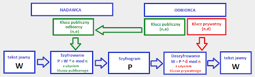

# Projekt: Algorytm szyfrowania RSA w języku Python

Projekt jest implementacją algorytmu szyfrowania RSA w języku Python, pozwala on zaszyfrować tekst oraz go odszyfrować

## Opis algorytmu
Algorytm Rivesta-Shamira-Adlemana (RSA) – jeden z pierwszych i obecnie najpopularniejszych asymetrycznych algorytmów kryptograficznych z kluczem publicznym, zaprojektowany w 1977 przez Rona Rivesta, Adiego Shamira oraz Leonarda Adlemana. Pierwszy algorytm, który może być stosowany zarówno do szyfrowania, jak i do podpisów cyfrowych. Bezpieczeństwo szyfrowania opiera się na trudności faktoryzacji dużych liczb złożonych.

### Generowanie kluczy
W celu wygenerowania pary kluczy (prywatnego i publicznego) należy posłużyć się algorytmem:

* Wybieramy losowo dwie duże liczby pierwsze p i q (najlepiej w taki sposób, aby obie miały zbliżoną długość w bitach, ale jednocześnie były od siebie odległe wartościami – istnieją lepsze mechanizmy faktoryzacji, jeżeli liczba ma dzielnik o wartości bliskiej √n.
* Obliczamy wartość n = pq.
* Obliczamy wartość funkcji Eulera dla n: φ(n)=(p-1)(q-1).
* Wybieramy liczbę e (1 < e < φ(n)) względnie pierwszą z φ(n).
* Znajdujemy liczbę d, gdzie jej różnica z odwrotnością modularną liczby e jest podzielna przez φ(n):
d ≡ e−1 (mod φ(n)).
Ta liczba może być też prościej określona wzorem:
d⋅e ≡ 1 (mod φ(n)).

Klucz publiczny jest definiowany jako para liczb (n, e), natomiast kluczem prywatnym jest para (n, d).

### Szyfrowanie i deszyfrowanie
Zanim zaszyfrujemy wiadomość, dzielimy ją na bloki m o wartości liczbowej nie większej niż n, a następnie każdy z bloków szyfrujemy według poniższego wzoru:
c≡e^m(mod n)
Zaszyfrowana wiadomość będzie się składać z kolejnych bloków c. Tak stworzony szyfrogram przekształcamy na tekst jawny, odszyfrowując kolejne blok c według wzoru:
m≡c^d(mod n)




## Opis funkcji

```python
def gcd(a, b)
```
Algorytm euklidesa;
Zwraca nwd(najwiekszy wspólny dzielnik) liczb a i b, potrzebny do funkcji generateKeyPair(p,q), aby określić czy liczby a ib są względnie piersze

```python
def extGcd(a, b)
```
Rozszerzony algorytm Euklidesa(pozwala wyznaczyć liczby całkowite w równaniu a*p+b*q=NWD(a,b));
Zwraca nwd, wsp. przy największej liczbie, wsp. przy najmniejszej liczbie, np dla nwd(174,18) zwraca 6,-1,10 --------> 6=(-1)*174+10*18

```python
def isPrime(number)
```
Funkcja sprawdzająca, czy liczba podana jako argument jest liczbą pierwszą, zwraca True lub False

```python
def drawPrimeNumber(number)
```
Funkcja służąca do zwracania listy 2 pierwszych liczb losowych z zakresu od 2 do 1000, potrzeban do tego jeżeli nie chcemy sami wpisywać liczb pierwszych do utworzenia klucza publicznego i prywatnego

```python
def generateKeyPair(p, q)
```
Funkcja służąca do generowania kluczy publicznego i prywatnego, jako argumenty podajemy 2 liczby pierwsze, nastepnie funkcja liczy ich iloczyn, potem
liczymy funkcję eulera phi, potem wybieramy liczbe losową e (1 < e < phi), później używamy algorytmu nwd do zobaczenia czy e i phi są względnie pierwsze,
jeżeli nie są to losujemy takie e, aż nwd(e,phi)=1, nastepnie używając funkcji extGcd(a,b) wyliczamy nwd, wsp. przy największej liczbie, wsp. przy 
najmniejszej liczbie, potem upewniamy się czy klucz prywatny jest większy od 0 czyli czy w  wsp. przy najmniejszej liczbie jest dodatn, jeśłi nie to 
dodajemy phi w końcu zwracamy klucz publiczny i prywatny, np. publiczny klucz(e=39,n=391) oraz prywatny klucz(d=27,n=391)

```python
def encrypt(privateKey, text)
```
Funkcja służąca zaszyfrowania tekstu, jako argumenty przyjmuje  klucz prywatny oraz tekst do zaszyfrowania, szyfrując używamy wzoru c≡e^m(mod n), gdzie 
e=cyfra Unicode z każdej literki, m= klucz prywatny(liczba d), n=iloczyn liczb pierszych, zwracany zaszyfrowany tekst w postaci listy liczb

```python
def decrypt(privateKey, text)
```
Funkcja służąca odszyfrowania tekstu, jako argumenty przyjmuje  klucz publiczny oraz listę liczb, odszyfrowując używamy wzoru m≡c^d(mod n), gdzie c=znak z każdej cyfry jako znak Unicode, d= klucz prywatny(liczba e), n=iloczyn liczb pierszych, zwracany odszyfrowany tekst w postaci jawnej


## Uruchomienie
```
python3 szyfrowanie.py
```

## Wersja Pythona
3.9.0

## Źródła 
[Algorytm Euklidesa(postać podstawowa i rozszerzona)](https://pl.wikipedia.org/wiki/Algorytm_Euklidesa)\
[Algorytm RSA](https://pl.wikipedia.org/wiki/RSA_(kryptografia))

## Autor,data
Wojciech Sękowski,13.01.2020
